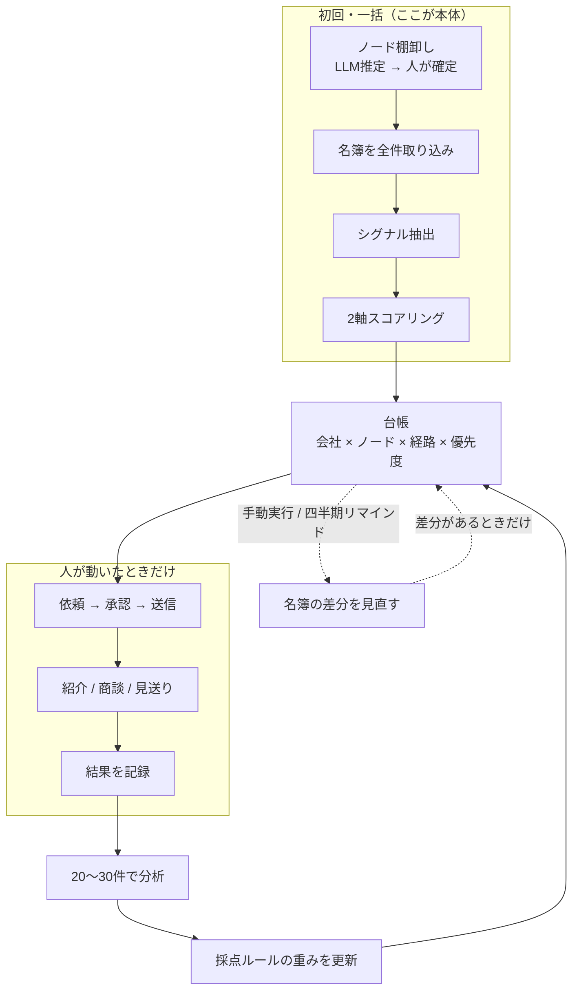
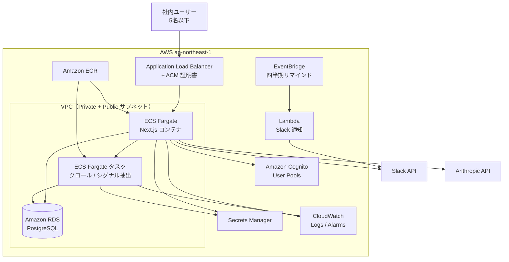
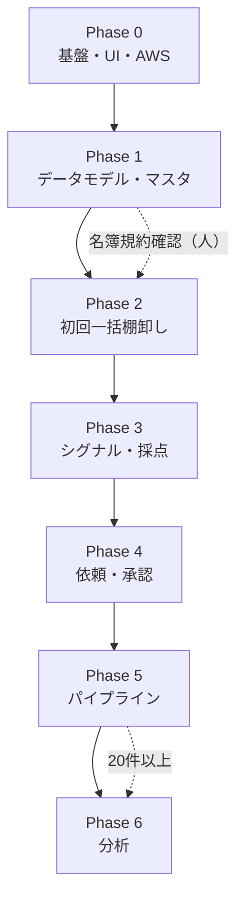

# ARO 実装計画書

| 項目 | 内容 |
|---|---|
| 文書名 | パートナー開拓支援システム（ARO）実装計画書 |
| 版数 | 0.1（ドラフト） |
| 作成日 | 2026-09-04 |
| 前提文書 | 概要設計書 0.1 |
| UI 参照元 | `/Users/kohei/Projects/dan1-new-system`（`docs/15_ui_design_spec.md` / `apps/web/components`） |
| 既存資産 | `/Users/kohei/Projects/sier-partner-leads` |
| クラウド | **AWS**（リージョン: `ap-northeast-1` 東京） |
| データベース | **PostgreSQL**（Amazon RDS。Supabase は使用しない） |

---

## 1. 本計画の位置づけ

本書は概要設計書 0.1 を実装に落とすための計画書である。概要設計書との主な差分は次の3点である。

1. **実行モデル**: 月次バッチ前提をやめ、初回一括で台帳を作り、以後はイベント駆動 + 手動再クロールとする。
2. **インフラ**: Supabase / Vercel ではなく、**AWS + RDS PostgreSQL** を前提とする。
3. **UI/UX**: `dan1-new-system` のデザイントークン・レイアウト・共通コンポーネントを移植する。

---

## 2. 方針転換（実行モデル）

### 2.1 背景

地方 SIer の会員名簿と企業サイトの事業案内は、月単位ではほとんど変化しない。日次スキル（`sier-partner-screening`）は初日に4社を登録した後、更新が止まっている。本システムの価値は「発見を続けること」より、**作った台帳を紹介できる順に消化し、結果で採点を直すこと**にある。

### 2.2 概要設計書からの変更

| 項目 | 概要設計書 | 本計画 |
|---|---|---|
| 探索の駆動 | 月次バッチで自動 | 初回一括で台帳を作り、以後は手動実行 |
| 名簿の再取得 | 月次・全ノード | 定期 Cron は置かない。手動実行 + 四半期リマインド |
| シグナル再抽出 | 月次・全社 | 新規登録時と、人が「再調査」を指示したときのみ |
| スコア再計算 | 月次 | ルール変更時とシグナル更新時のみ（イベント駆動） |
| Slack 通知 | 新規候補の「要確認」 | 新規候補 + **承認待ちの滞留・依頼後の無反応** |
| システムの性格 | 更新されるフィード | **台帳（グラフ）+ 営業の進行管理** |

### 2.3 処理の実態



---

## 3. 技術構成

### 3.1 スタック一覧

| レイヤ | 採用 | 備考 |
|---|---|---|
| リポジトリ構成 | 単一 Next.js アプリ | 利用者5名・データ数百件の規模に合わせ、モノレポにしない |
| フロント | Next.js App Router / TypeScript / Tailwind CSS | dan1 と同一 |
| UI コンポーネント | dan1 の `components/layout` + `components/ui` を移植 | `packages/ui` には切り出さない |
| アイコン | lucide-react | dan1 と同一 |
| API | Server Actions + Route Handlers | 専用 API サーバは立てない |
| **DB** | **Amazon RDS for PostgreSQL** | Supabase は使用しない。SQL は Prisma 経由 |
| ORM | Prisma | スキーマ変更が頻繁になる前提 |
| **認証** | **Amazon Cognito User Pools** + Next.js ミドルウェア | メール招待制。ロールは Cognito グループまたは DB の `users.role` |
| LLM | Anthropic API (Claude) | シグナル抽出・依頼文生成 |
| Web 取得 | fetch + HTML パーサ、動的ページのみ Playwright | robots.txt 尊重・3秒間隔 |
| 通知 | Slack API | 既存テンプレートを踏襲 |
| **ホスティング** | **AWS ECS Fargate**（Next.js コンテナ） | ALB + ACM で HTTPS |
| **長時間処理** | **ECS Fargate タスク**（ワンショット） | 名簿クロール・シグナル抽出。進捗は DB に記録 |
| **定期リマインド** | **Amazon EventBridge** → Lambda → Slack | 四半期の名簿見直しリマインドのみ（データ更新そのものはしない） |
| シークレット | **AWS Secrets Manager** | DB 接続文字列・Anthropic API キー・Slack トークン |
| ログ・監視 | **CloudWatch Logs / Metrics / Alarms** | 業務時間内の参照が主用途 |

### 3.2 dan1-new-system との差分

| 項目 | dan1-new-system | ARO |
|---|---|---|
| クラウド | GCP | **AWS** |
| DB | Cloud SQL (MySQL) | **RDS PostgreSQL** |
| 構成 | turbo モノレポ（web + api + jobs） | **単一 Next.js** |
| 認証 | 独自（社員番号 / HACCP / 施設） | **Cognito（メール招待）** |
| バッチ | Cloud Run Jobs | **ECS Fargate タスク** |
| UI | misaki-reports 系 | **dan1 と同一トークン・コンポーネント** |

### 3.3 長時間処理の実行方式

名簿クロール・シグナル一括抽出は数分〜数十分かかる可能性がある。Next.js の Route Handler 内で同期的に完結させず、次の流れとする。

1. 管理画面から「実行」を押す → `job_runs` レコードを `pending` で作成
2. ECS Fargate タスクを起動（環境変数で `job_run_id` を渡す）
3. タスクが進捗を `job_runs` に書き込み、画面はポーリングまたは SSE で表示
4. 完了時に Slack 通知（差分件数・エラー有無）

dan1 の `ExportProgressBanner` と同じ UX を目指す。

---

## 4. AWS インフラ構成

### 4.1 全体像



### 4.2 サービス構成

| サービス | 用途 | 構成（初期） |
|---|---|---|
| ECS Fargate（web） | Next.js アプリ | CPU 0.5 vCPU / メモリ 1GB / desired count 1 |
| ECS Fargate（worker） | クロール・シグナル抽出 | CPU 1 vCPU / メモリ 2GB / 必要時のみ起動 |
| RDS PostgreSQL | 正データ | `db.t4g.micro` または `db.t4g.small` `[要確認]` |
| ALB | HTTPS 終端・ルーティング | ターゲット: ECS web サービス |
| Cognito User Pools | 認証 | メール招待・パスワードポリシー |
| Secrets Manager | 機密情報 | DB URL / API キー |
| EventBridge | スケジュール | 四半期: 名簿見直しリマインド |
| CloudWatch | ログ・監視 | ログ保持 30日 `[要確認]` |

**最小インスタンス数 1 の理由**: 利用者5名以下で常時高負荷ではないが、社内ツールとして業務時間中に即座に参照できることを優先する。コールドスタートを避けるため web タスクは常時1台。

**ECS を選ぶ理由**: App Runner も候補だが、ワーカータスク（Fargate run-task）と同一 VPC 内 RDS 接続を揃えやすい。Terraform / CDK で IaC 化しやすい点も優先。

### 4.3 データベース（RDS PostgreSQL）

| 項目 | 設定 |
|---|---|
| エンジン | PostgreSQL 16 `[要確認]` |
| インスタンス | `db.t4g.small`（vCPU 2 / メモリ 2GB）`[要確認]` |
| ストレージ | gp3 20GB。自動拡張を有効 |
| 可用性 | 単一 AZ（NFR: 業務時間内に参照できれば足りる） |
| 接続 | Private サブネット。ECS から VPC 内接続 |
| バックアップ | 自動バックアップ 7日 `[要確認]`。PITR は任意 |
| 文字セット | UTF-8 |
| タイムゾーン | `Asia/Tokyo` |
| 接続プール | Prisma の `connection_limit` を ECS タスク数に合わせて設定 |

**JSONB の利用**: `signals` の根拠、`company_scores.breakdown` など柔軟な構造は PostgreSQL の JSONB で保持する。リレーショナルな経路管理（ノード所属・依頼・パイプライン）と両立する。

**マイグレーション**: Prisma Migrate。本番適用は CI/CD パイプラインから `prisma migrate deploy` を実行する。

### 4.4 ネットワーク

| 項目 | 設定 |
|---|---|
| VPC | /16。Public サブネット（ALB）+ Private サブネット（ECS / RDS） |
| RDS | Private サブネットのみ。セキュリティグループで ECS から 5432 を許可 |
| 外向き通信 | ECS タスクから Anthropic API / Slack / 外部名簿 URL への HTTPS を NAT Gateway 経由で許可 |
| ドメイン | Route 53 + ACM（社内 DNS または独自ドメイン）`[要確認]` |

### 4.5 認証（Cognito）

Supabase Auth は使用しない。Amazon Cognito User Pools で次を満たす。

| 項目 | 設定 |
|---|---|
| サインアップ | 管理者招待のみ（自己登録不可） |
| サインイン | メール + パスワード |
| ロール | Cognito グループ `admin` / `member`、または初回ログイン時に DB `users` と同期 |
| 管理者 | スコア設定・ノード編集・手動ジョブ実行が可能 |
| 一般 | 閲覧・承認・状態更新が可能 |
| セッション | Next.js 側で Cognito JWT を検証。ミドルウェアで `(app)` ルートを保護 |

### 4.6 CI/CD

| 項目 | 設定 |
|---|---|
| リポジトリ | GitHub（既存 `sier-partner-leads` を拡張、または新リポジトリ `[要確認]`） |
| ビルド | GitHub Actions → Docker イメージ → ECR push |
| デプロイ | ECS サービスの rolling update |
| マイグレーション | デプロイ前後に `prisma migrate deploy` |
| 環境 | `dev` / `prod`（ステージングは任意） |

### 4.7 非機能要件との対応

| 分類 | 要件 | AWS での実現 |
|---|---|---|
| 想定利用者数 | 5名以下 | ECS 1タスクで十分 |
| データ規模 | 候補数百件 | RDS t4g.small |
| 性能 | 画面 2秒以内 | ALB + 単一 ECS、インデックス設計 |
| 可用性 | 業務時間内参照 | 単一 AZ、日次バックアップ |
| 監査 | 操作者・日時記録 | `audit_logs` テーブル + CloudWatch |
| バックアップ | 日次 | RDS 自動バックアップ |
| 個人情報 | 収集しない | 法人情報・公開情報のみ |

---

## 5. データモデル

概要設計書 5.2 を基本とし、4点を変更する。

### 5.1 変更点

| # | 変更 | 理由 |
|---|---|---|
| 1 | `paths` を実テーブルにせず、ビュー `v_paths` として導出 | `intro_requests` が既に三つ組を保持。依頼前の経路候補は導出で足りる |
| 2 | `crawl_runs` を追加 | 取得元 URL・日時・robots 判定・結果件数（概要設計書 4.4） |
| 3 | `job_runs` を追加 | ECS ワーカーの進捗・状態管理 |
| 4 | `audit_logs` を追加 | スコア変更・依頼承認・状態変更の監査 |
| 5 | `users` を追加 | Cognito sub とロールの紐付け |

### 5.2 テーブル一覧

| テーブル | 役割 |
|---|---|
| `users` | Cognito ユーザーとロール（admin / member） |
| `partners` | 既存パートナー。紹介の依頼先 |
| `nodes` | 紹介ノード（vendor / association / financial） |
| `partner_node_memberships` | パートナー × ノードの所属 |
| `companies` | 候補企業 |
| `node_memberships` | 会社 × ノードの所属 |
| `signals` | 抽出シグナル（根拠テキスト・出典 URL 必須） |
| `scoring_rules` | 採点ルール（重み・バージョン） |
| `company_scores` | 採点結果（履歴保持） |
| `intro_requests` | 紹介依頼（下書き → 承認 → 送信記録） |
| `pipeline_events` | パイプライン履歴（イベント積み上げ） |
| `crawl_runs` | 名簿取得履歴 |
| `job_runs` | 非同期ジョブの実行履歴 |
| `audit_logs` | 監査ログ |

### 5.3 ビュー

```sql
-- 依頼前の経路候補: 既存パートナー × ノード × 候補企業
CREATE VIEW v_paths AS
SELECT
  p.id   AS partner_id,
  n.id   AS node_id,
  c.id   AS company_id
FROM companies c
JOIN node_memberships nm ON nm.company_id = c.id
JOIN nodes n ON n.id = nm.node_id
JOIN partner_node_memberships pnm ON pnm.node_id = n.id
JOIN partners p ON p.id = pnm.partner_id
WHERE c.status = 'candidate'
  AND p.is_active = true;
```

### 5.4 優先度マトリクス（穴の埋め）

| ICP 適合度 | 経路強度 | 優先度 |
|---|---|---|
| 高 | 高 | A |
| 高 | 中 | B |
| 中 | 高 | B |
| 高 | **低** | **C** |
| 高 | なし | C |
| 中 | 中以下 | hold |
| 低以下 | — | hold |

### 5.5 除外判定

既存 `score_site.py` のキーワード4語による生成AI判定は採用しない。除外条件（自社で生成AI・内製開発を打ち出している / 大手 SIer 完全子会社）は **LLM 判定 + 根拠テキスト必須**。根拠が取れない場合は判定を採用せず `on_hold` とする。

---

## 6. UI/UX 仕様（dan1-new-system 準拠）

`dan1-new-system/docs/15_ui_design_spec.md` を正本とする。ビジュアルの色・角丸・余白・コンポーネント形状は dan1 と揃え、業務固有の情報設計のみ ARO 側で拡張する。

### 6.1 デザイントークン

```css
:root {
  --color-primary: 112 78 48;
  --color-primary-hover: 90 60 36;
  --color-primary-light: 243 235 228;
  --color-accent: 226 160 18;
  --color-accent-hover: 201 142 15;
  --color-accent-light: 251 243 224;
  --color-bg: 244 247 242;
  --color-surface: 255 255 255;
  --color-surface-subtle: 250 246 241;
  --color-sidebar: 255 255 255;
  --color-text: 112 78 48;
  --color-muted: 122 101 82;
  --color-border: 217 205 191;
}
```

| トークン | 値 | 用途 |
|---|---|---|
| primary | `#704E30` | 主ボタン、アクティブナビ |
| accent | `#E2A012` | アクセント |
| success | `#2DA44E` | 提携・成功 |
| warning | `#BF8700` | 滞留・要確認 |
| danger | `#CF222E` | 見送り・除外 |
| bg | `#F4F7F2` | ページ背景 |

フォント: Inter + Noto Sans JP。本文 14px / line-height 1.5。影は原則なし。

### 6.2 アプリシェル

```
┌────────────┬──────────────────────────────────────────┐
│ Sidebar    │ main（flex-1 overflow-auto）              │
│ w-56       │  ┌────────────────────────────────────┐  │
│ sticky     │  │ ユーティリティヘッダー h-12         │  │
│ h-screen   │  ├────────────────────────────────────┤  │
│ border-r   │  │ content: px-5 py-6 lg:px-8         │  │
│ bg-sidebar │  │  PageHeader                         │  │
│ [Brand]    │  │  SectionNavTabs（該当画面のみ）      │  │
│ Nav items  │  │  本文                               │  │
└────────────┴──────────────────────────────────────────┘
```

dan1 の `AppLayout` / `Sidebar` / `PageHeader` / `DataTable` / `Button` / `Input` / `Badge` / `FilterChip` を移植する。

### 6.3 サイドバー構成

```
ダッシュボード
── 開拓 ──
候補一覧 / 依頼キュー / パイプライン
── 分析 ──
分析
── 設定 ──
ノード管理 / 既存パートナー / スコア設定 / システム管理
```

### 6.4 画面一覧

| # | 画面 | パス | レイアウト型 |
|---|---|---|---|
| 1 | ログイン | `/login` | 中央カード（dan1 LoginForm 準拠） |
| 2 | ダッシュボード | `/dashboard` | 統計カード + 滞留セクション |
| 3 | 候補一覧 | `/companies` | FilterChip + DataTable + Pagination |
| 4 | 候補一覧（2軸） | `/companies?view=matrix` | ICP × 経路強度マトリクス |
| 5 | 候補詳細 | `/companies/[id]` | SectionNavTabs + カード分割 |
| 6 | 依頼キュー | `/intro-requests` | 左リスト + 右エディタ |
| 7 | パイプライン | `/pipeline` | カンバン |
| 8 | ノード管理 | `/nodes` | Master CRUD |
| 9 | 既存パートナー | `/partners` | Master CRUD |
| 10 | スコア設定 | `/scoring-rules` | マトリクス編集 + バージョン履歴 |
| 11 | 分析 | `/analytics` | 統計 + テーブル（Phase 6） |
| 12 | システム管理 | `/admin` | 監査ログ + 手動ジョブ実行 |

### 6.5 UI 上の重要な制約

| 制約 | 実装 |
|---|---|
| 依頼の自動送信しない | 送信ボタンを置かない。`sent_at` は人が記録 |
| Slack は「要確認」 | 通知文面テンプレートを踏襲 |
| 色だけで意味を伝えない | 優先度・パイプライン段階にラベル文字を併記 |
| 根拠必須 | シグナル一覧に evidence_text + source_url を常時表示 |
| 見送り理由必須 | カンバンで見送り列へ移動時にモーダル。キャンセルで移動取り消し |

### 6.6 ダッシュボードの主役

月次の新規候補数ではなく、**滞留案件**を主役とする。

- 承認待ち件数（`intro_requests.status = draft`）
- 依頼済のまま N 日経過（設定値 `[要確認]`、初期 14日）
- 優先度 A の未着手件数
- パイプライン概況（各 stage の件数）

---

## 7. フェーズ別実装計画

### 7.1 フェーズ一覧

| Phase | 名称 | 主な成果 |
|---|---|---|
| 0 | 基盤・UI 移植 | AWS 基盤 + Next.js + Prisma + dan1 UI + Cognito |
| 1 | データモデル・マスタ | 全テーブル + ノード/パートナー管理 + 監査 |
| 2 | 初回一括棚卸し | ノード推定 + 名簿取り込み + 候補一覧 |
| 3 | シグナル抽出・採点 | LLM + 2軸スコア + スコア設定画面 |
| 4 | 依頼パッケージ・承認 | 文案生成 + 承認キュー + Slack |
| 5 | パイプライン・結果記録 | カンバン + 見送り理由（**最小構成の完了**） |
| 6 | 分析 | 転換率可視化（実績20件以上が前提） |

### 7.2 依存関係



### 7.3 Phase 0: 基盤・UI 移植

| # | タスク | 成果物 |
|---|---|---|
| 0-1 | AWS アカウント / VPC / サブネット / NAT | ネットワーク |
| 0-2 | RDS PostgreSQL 作成（dev / prod） | DB |
| 0-3 | Cognito User Pool 作成 | 認証 |
| 0-4 | ECR / ECS クラスタ / ALB / ACM | コンピュート |
| 0-5 | Secrets Manager（DB URL 等） | シークレット |
| 0-6 | Next.js App Router プロジェクト | アプリ |
| 0-7 | Prisma 初期スキーマ + `migrate deploy` パイプライン | ORM |
| 0-8 | dan1 の tailwind / globals.css / UI コンポーネント移植 | UI |
| 0-9 | AppLayout + Sidebar + nav-config（ARO 用） | シェル |
| 0-10 | Cognito ログイン + ミドルウェア保護 | 認証連携 |
| 0-11 | GitHub Actions → ECR → ECS デプロイ | CI/CD |
| 0-12 | CloudWatch Logs 連携 | 監視 |

**完了条件**: Cognito でログインでき、dan1 と同一見た目の空ダッシュボードが ALB 経由で表示される。RDS への接続が確立している。

### 7.4 Phase 1: データモデル・マスタ

| # | タスク |
|---|---|
| 1-1 | 全テーブルの Prisma スキーマ + マイグレーション |
| 1-2 | `audit_logs` 自動記録ミドルウェア |
| 1-3 | 既存パートナー CRUD 画面 |
| 1-4 | ノード CRUD 画面（`access_policy` / 規約メモ） |
| 1-5 | `scoring_rules` 初期投入（`references/scoring.md` から。ページ充実度項目は除外） |
| 1-6 | `candidates.csv` 4社移行（`legacy_score` は引き継がない） |
| 1-7 | 候補一覧（スコアなし状態） |

**完了条件**: ノード・パートナーを編集でき、既存4社が一覧に表示される。更新が監査ログに残る。

### 7.5 Phase 2: 初回一括棚卸し

| # | タスク |
|---|---|
| 2-1 | LLM によるノード推定 + 人の確認画面 |
| 2-2 | クローラ（robots 尊重・3秒間隔・`access_policy = public` のみ） |
| 2-3 | 名簿パーサ + 3県フィルタ |
| 2-4 | 重複排除（正規化名 + 所在地。法人番号があれば優先） |
| 2-5 | `crawl_runs` 記録 |
| 2-6 | ECS ワーカータスク + `job_runs` 進捗 UI |
| 2-7 | 管理画面からの手動実行 |
| 2-8 | 候補詳細（所属ノード・取得元 URL） |
| 2-9 | 空欄・取得失敗は候補にしない |

**完了条件**: 確定ノードの公開名簿から3県候補が台帳に入る。全レコードに取得元 URL と取得日時がある。

### 7.6 Phase 3: シグナル抽出・採点

| # | タスク |
|---|---|
| 3-1 | LLM シグナル抽出（根拠 + 出典必須） |
| 3-2 | 除外条件（LLM + 根拠） |
| 3-3 | 生成AI記述なし × 危機意識の組み合わせ判定 |
| 3-4 | ICP 適合度・経路強度の算出 |
| 3-5 | 優先度 A / B / C / hold |
| 3-6 | `company_scores` 履歴保持 |
| 3-7 | スコア設定画面（重み編集 + version） |
| 3-8 | 2軸マトリクス表示 |
| 3-9 | 「再調査」手動トリガ |

**完了条件**: 優先度が算出され、画面から重みを変更して再計算できる。変更前スコアが履歴として残る。

### 7.7 Phase 4: 依頼パッケージ・承認

| # | タスク |
|---|---|
| 4-1 | `v_paths` から依頼先決定 |
| 4-2 | 依頼文案生成（LLM） |
| 4-3 | 承認キュー（左リスト + 右エディタ） |
| 4-4 | 承認 → 送信記録の分離 |
| 4-5 | Slack「要確認」通知 |
| 4-6 | Slack 滞留リマインド |

**完了条件**: A/B 候補の依頼文案が生成・承認できる。Slack に「要確認」が届く。

### 7.8 Phase 5: パイプライン・結果記録

| # | タスク |
|---|---|
| 5-1 | カンバン（7段階） |
| 5-2 | 見送り理由必須モーダル |
| 5-3 | 滞留期間算出 → ダッシュボード |
| 5-4 | EventBridge → Lambda → Slack（四半期名簿見直しリマインド） |

**完了条件**: 状態変更と見送り理由が記録される。**ここまでが最小構成。**

### 7.9 Phase 6: 分析

実績20件以上蓄積後に着手。

| # | タスク |
|---|---|
| 6-1 | 経路別・シグナル別転換率 |
| 6-2 | 優先度と結果の相関 |
| 6-3 | 見送り理由の分布 |
| 6-4 | ルールバージョン間比較 |

### 7.10 Phase L: AI スキル化（実装済みの後追い）

Phase 3-1 / 4-2 の LLM を、キーワード仮実装のあとで置換する。

| # | タスク |
|---|---|
| L0 | `skills/signal-extract` / `skills/intro-draft` を正本にする |
| L1 | シグナル抽出ジョブがスキルを読んで Anthropic を呼ぶ。キーなしはキーワード fallback |
| L2 | 依頼下書きがスキル経由。承認キュー・非送信は維持 |
| L3 | 取扱マニュアルに「AI調査と依頼文」を追加 |

**完了条件**: キーありで根拠付きシグナルと AI 下書きが出る。キーなしでも現行どおり動く。採点は `scoring_rules` のまま。根拠不足では既存シグナルを消さない。

---

## 8. 実装配置

```
partnerscope/                    # リポジトリ名 [要確認]
├── app/
│   ├── globals.css
│   ├── layout.tsx
│   ├── (auth)/login/
│   └── (app)/
│       ├── layout.tsx
│       ├── dashboard/
│       ├── companies/
│       ├── intro-requests/
│       ├── pipeline/
│       ├── nodes/
│       ├── partners/
│       ├── scoring-rules/
│       ├── analytics/
│       └── admin/
├── components/
│   ├── layout/                  # dan1 から移植
│   ├── ui/                      # dan1 から移植
│   ├── companies/
│   ├── intro-requests/
│   ├── pipeline/
│   └── scoring/
├── lib/
│   ├── scoring/
│   ├── crawl/
│   ├── llm/
│   ├── slack/
│   ├── jobs/                    # ECS タスク起動
│   └── auth/                    # Cognito 連携
├── prisma/
│   ├── schema.prisma
│   └── migrations/              # SQL マイグレーション
├── worker/                      # ECS ワーカー用エントリ
│   └── main.ts
├── infra/                       # Terraform または CDK [要確認]
│   ├── vpc.tf
│   ├── rds.tf
│   ├── ecs.tf
│   ├── cognito.tf
│   └── alb.tf
├── Dockerfile
├── Dockerfile.worker
└── tailwind.config.ts
```

---

## 9. 既存資産の移行

| 既存資産 | 移行方針 |
|---|---|
| `data/candidates.csv` | `companies` へ4社投入。`legacy_score` は引き継がない |
| `references/scoring.md` | `scoring_rules` 初期データ。ページ充実度項目は移さない |
| `references/data-sources.md` | **`nodes` へ移送**（協会名簿 → association、販売店一覧 → vendor） |
| `scripts/score_site.py` | 正規化・HTML 抽出を `lib/scoring` へ。除外は LLM へ |
| `scripts/git_append.py` | 正規化ロジックのみ移植。追記処理は廃止 |
| `CONTEXT.md` | 設定値を DB / 環境変数へ |
| GitHub Issue 運用 | 廃止 → パイプライン画面 |
| Slack 通知 | 継続（DM `D01BG830F9U` `[要確認]`） |

---

## 10. 概要設計書からの変更点まとめ

| # | 項目 | 変更内容 |
|---|---|---|
| 1 | 実行モデル | 月次バッチ → 初回一括 + イベント駆動 + 手動再クロール |
| 2 | DB | Supabase → **RDS PostgreSQL（SQL）** |
| 3 | 認証 | Supabase Auth → **Amazon Cognito** |
| 4 | ホスティング | Vercel → **AWS ECS Fargate** |
| 5 | バッチ | Vercel Cron → **手動実行 + ECS タスク** |
| 6 | 定期処理 | 月次更新 → **四半期 Slack リマインドのみ** |
| 7 | `paths` | 実テーブル → ビュー `v_paths` |
| 8 | 追加テーブル | `crawl_runs` / `job_runs` / `audit_logs` / `users` |
| 9 | 優先度 | 「ICP高 × 経路低」→ C |
| 10 | 除外判定 | キーワード → LLM + 根拠必須 |
| 11 | UI | dan1-new-system 準拠を明文化 |

---

## 11. 未決事項

| # | 項目 | 影響 | 期限 |
|---|---|---|---|
| 1 | 既存パートナーは SDC 1社か2社か | `partners` 初期データ | Phase 1 前 |
| 2 | 提携目標（何社・いつまで） | 依頼ペース設計 | Phase 4 前 |
| 3 | 各ノード名簿の利用規約 | `access_policy` 分布 | Phase 2 前 |
| 4 | 依頼文の送信チャネル | 下書き形式 | Phase 4 前 |
| 5 | Slack 通知先（DM 継続かチャネル化か） | 通知設定 | Phase 4 前 |
| 6 | リポジトリ名（`sier-partner-leads` 拡張 vs 新規 `partnerscope`） | 構成 | Phase 0 前 |
| 7 | IaC（Terraform vs CDK） | `infra/` | Phase 0 |
| 8 | RDS インスタンスサイズ・Multi-AZ 要否 | コスト・可用性 | Phase 0 |
| 9 | ドメイン・Route 53 | ALB + ACM | Phase 0 |
| 10 | 法人番号付与（gBizINFO 突合）のタイミング | 重複排除精度 | Phase 2（任意） |
| 11 | ブランド色（dan1 流用 vs ARO 独自） | CSS 変数1箇所 | Phase 0 |

---

## 12. 関連ドキュメント

| 参照先 | 内容 |
|---|---|
| 概要設計書 0.1 | 背景・データモデル・機能設計の原典 |
| `dan1-new-system/docs/15_ui_design_spec.md` | UI デザインの正本 |
| `dan1-new-system/docs/13_phase_plan.md` | フェーズ計画の書き方の参考 |
| `sier-partner-leads/CONTEXT.md` | 現行運用設定値 |
| `sier-partner-leads/references/scoring.md` | 採点ルール移行元 |
| `sier-partner-leads/references/data-sources.md` | ノード移行元 |

---

## 13. 工数見積について

本書では工数・期間を提示していない。Phase 0 の AWS 基盤構築と dan1 UI 移植の実績、Phase 2 のクローラ精度、既存パートナーの所属ノード調査（未決事項1）が見積の主要因となる。開発体制が確定し、未決事項1・3が解消された段階で、フェーズごとの工数を別途作成する。
